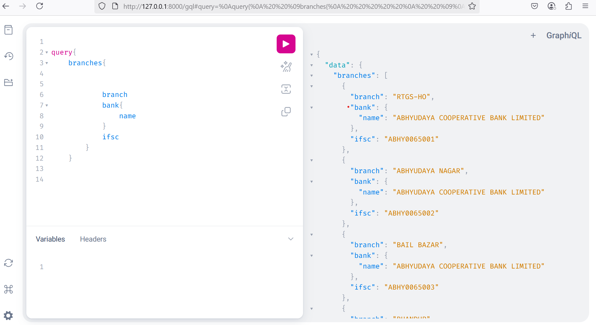

<<<<<<< HEAD
# DEMO

# Indian Bank Branch GraphQL API

This is a Django + GraphQL API that serves real-time Indian bank branch data using a PostgreSQL backend. The project uses real BANK IFSC data and is designed for evaluation under the assignment. It is also fully deployable on **Render.com** (free, no card required).

---

## 🔧 Tech Stack

- **Backend**: Django 5 + Graphene-Django (GraphQL)
- **Database**: PostgreSQL (local and cloud-ready)
- **Deployment**: Render.com (free) or heroku (payment verification)
- **Server**: Gunicorn + WhiteNoise

---

## 🌐 Live Demo (after deployment)

```
https://demo-2glo.onrender.com/gql
```

---

## 📂 Features

- GraphQL endpoint at `/gql`
- Query all branches with nested bank details
- Optimized with `select_related` for performance
- Test case included
- Fully configured for Render deployment

---

## 🛠️ Local Setup Instructions

### 1. Clone the repo

```bash
git clone https://github.com/shrijeetpawar/demo.git
cd demo
```

### 2. Create virtual environment

```bash
python -m venv venv
venv\Scripts\activate   # Windows
source venv/bin/activate  # Mac/Linux
```

### 3. Install dependencies

```bash
pip install -r requirements.txt
```

### 4. Import PostgreSQL Data

Use the RBI dataset from `indian_banks.sql`. Fix encoding using:

```bash
set PGCLIENTENCODING=WIN1252 && psql -U postgres -d bankdb -f indian_banks.sql
```

Update `settings.py`:

```python
DATABASES = {
  'default': {
    'ENGINE': 'django.db.backends.postgresql',
    'NAME': 'bankdb',
    'USER': 'postgres',
    'PASSWORD': 'yourpassword',
    'HOST': 'localhost',
    'PORT': '5432',
  }
}
```

---

## 🔍 Sample GraphQL Query

```graphql
{
  branches {
    ifsc
    branch
    bank {
      name
    }
  }
}
```

---

## ✅ Test the API

```bash
python manage.py test
```

---

## ☁️ Deploy on Render (No Credit Card Needed)

1. Push code to GitHub
2. Go to [render.com](https://render.com) → New Web Service → Connect repo
3. Start command:
   ```
   gunicorn config.wsgi
   ```
4. Add environment variables:
   - `DATABASE_URL` → from Render’s DB
5. In Shell: `python manage.py migrate`

---

## 📄 Method Used to Solve the Assignment

- **Data Source**: Used `indian_banks.sql` from GitHub
- **Encoding Fix**: Used `PGCLIENTENCODING=WIN1252` for Windows-encoded data
- **Model Setup**: Django models for `banks` and `branches`, marked `managed = False`
- **Schema**: GraphQL schema using `graphene-django`, with nested bank branch querying
- **Optimizations**: `select_related` used to prevent N+1 queries
- **Testing**: Unit test with mocked data using `schema_editor`
- **Deployment**: Fully configured `requirements.txt`, `Procfile`, and `runtime.txt`
- **Hosting**: Free Render deployment without payment setup

---

## ⏱ Time Taken

| Task                         | Time     |
|------------------------------|----------|
| Data prep & encoding fix     | 2.5 hrs  |
| Django + GraphQL setup       | 2 hrs    |
| Testing + Validation         | 1 hr     |
| Deployment (Render)          | 2.5 hrs  |
| **Total**                    | **8 hrs**|

---

## Output




## 🙋 Author

- Name: **Shrijeet Pawar**
- GitHub: [@shrijeetpawar](https://github.com/shrijeetpawar)

=======
# demo
>>>>>>> parent of 037c296 (Update README.md)
